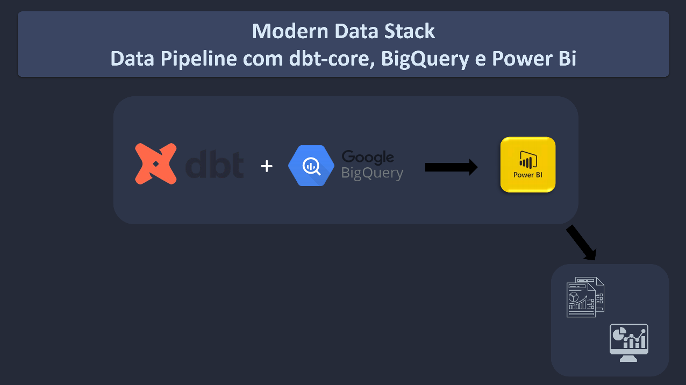
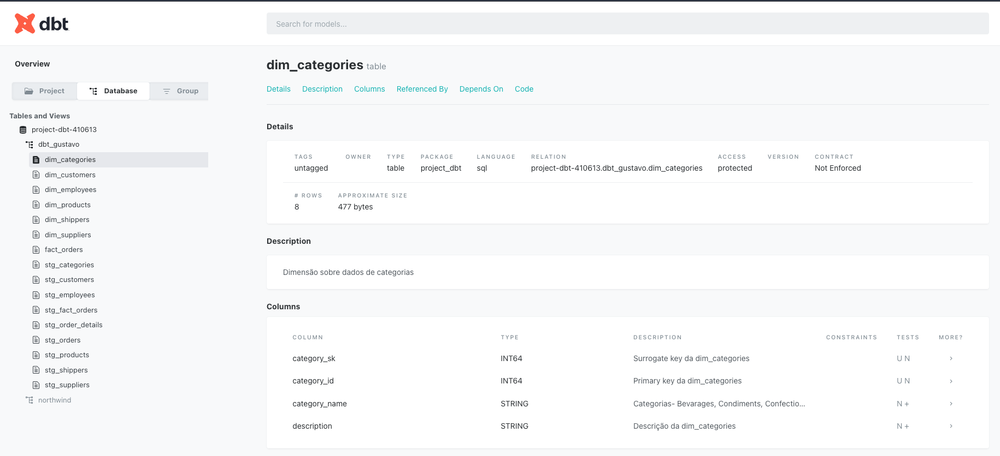
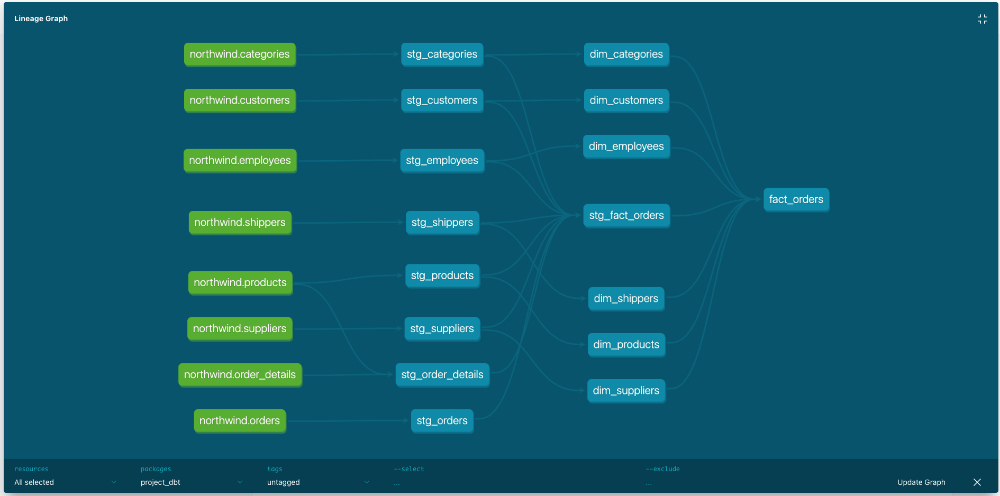

# Data Pipeline com dbt-core, BigQuery e Power Bi



## Sobre o Projeto

Este repositório tem como objetivo criar um pipeline de dados fim a fim usando as tecnologias dbt-core, o Data Warehouse moderno BigQuery e o Power Bi como ferramenta de data viz.
O desenvolvimento do projeto leva em consideração os conceitos fundamentais de modelagem dimensional star schema.

**YouTube**: Clique para assistir a instalação e configuração do projeto no [link](https://youtu.be/M-CgBBcNgfM?si=mPnnj8s2NDICzMj5)

### Abordagens do dbt-core:

* **Criação do ambiente de desenvolvimento**: Instalação do dbt-core, criação de ambiente virtual, estrutura de pastas e diretórios e conexão remota com Biguery.

* **Testes**: Garanta que seu código funcione como esperado, criando testes unitários e de integração.

* **Documentação**: Isso inclui informações sobre a estrutura do projeto, como os modelos estão organizados, como os dados são transformados, e quaisquer considerações especiais.

## Começando

### Pré-requisitos para rodar o projeto

* **Conta Google Cloud Provider**: Cadastro, criação de projeto e chave de acesso para conexão remota com BigQuery.

* **VSCode**: Editor de código. [Instruções de instalação do VSCode aqui](https://code.visualstudio.com/download).

* **Pyenv**: É usado para gerenciar versões do Python. [Instruções de instalação do Pyenv aqui](https://github.com/pyenv/pyenv#installation). Vamos usar nesse projeto o Python 3.10.11. Para usuários Windows, é recomendado assistirem esse tutorial [Youtube](https://www.youtube.com/watch?v=TkcqjLu1dgA).

* **Poetry**: Este projeto utiliza Poetry para gerenciamento de dependências. [Instruções de instalação do Poetry aqui](https://python-poetry.org/docs/#installation). Se você é usuário Windows, recomendo assistir esse vídeo: [Youtube](https://www.youtube.com/watch?v=BuepZYn1xT8). Que instala o Python, Poetry e VSCode. Mas um simples comando PIP INSTALL POETRY já resolve.

### Instalação e Configuração

1. Clone o repositório:

```bash
git clone https://github.com/gustavobi4yourdata/Data-Engineering-Project-05.git
cd Data-Engineering-Project-05/project_dbt
```

2. Instale as dependências do projeto:

```bash
poetry install
```

3. Ative ambiente virtual:

```bash
poetry shell
```

4. Instale dependências do projeto dbt:

```bash
dbt deps
```
5. Substitua e copie sua chave de segurança para dentro da pasta `bigquery`

6. Ajuste o caminho do seu arquivo `profiles.yml` em `keyfile`

7. Verifique teste de conexão remota com o bigquery bem como dependências do projeto dbt-core

```bash
# certifique-se que você esta no diretório do projeto: 'project_dbt'
dbt debug
```

## Estrutura do projeto

```graphql
Data-Engineering-Project-05/
│
├── project_dbt/
│   ├── analyses/
│   ├── bigquery/     # Credencial de acesso remoto ao BigQuery
│   ├── macros/
│   ├── models/       # Modelo dbt-core (processo ETL)
│       ├── marts/    # Instruções SQL
│       ├── staging/  # Instruções SQL
│   ├── seeds/
│   ├── snapshot/
│   └── tests/
│── Northwind/
│   ├── tables/       # Dados importados para o BigQuery
│── PowerBI/
```

## Comandos de execução para rodar o projeto
Antes de rodar o projeto certifique-se:
*  Que você esta no diretório do projeto: `project_dbt` 
*  Que tenha criado o "Conjunto de dados" no BigQuery com nome `northwind`
*  Que tenha feito o upload de todos os arquivos csv para o BigQuery (você encontra os arquivos csv dentro da pasta Northwind)

1. Execute o comando para rodar o Data Pipeline
```bash
dbt run
```

2. Execute o comando para assegurar que todos testes passaram
```bash
dbt test
```

3. **Documentação dbt-core**: Execute os comandos para criar a documentação do projeto
```bash
dbt docs generate
dbt docs serve --port 8001
```

## Diagrama entidade-relacionamento
#### Fonte de dados: **Northwind OLTP**  


## Documentação dbt


## Gráfico Linhagem


### Principais comandos dbt-core

Para saber mais comandos de execução do dbt visite [documentação oficial](https://docs.getdbt.com/docs/collaborate/documentation)

```bash
# Verifica estado de conexão com bigquery e dependências do projeto
dbt debug
```

```bash
# Roda todo o projeto
dbt run
```

```bash
# Executa um arquivo sql específico
dbt run --select nome_arquivo.sql
```

```bash
# Roda todos os testes do projeto
dbt test
```

```bash
# Exeuta um teste específico
dbt test -m nome_teste
```

```bash
# Faz o build da documentação do projeto
dbt docs generate
```

```bash
# Cria servidor para documentação do projeto
dbt docs serve
```
```bash
# Remove arquivos temporários
dbt clean
```
## Contato

Para dúvidas, sugestões ou feedbacks:

* **Gustavo Souza** - [gustavo.souza@bi4yourdata.com](mailto:gustavo.souza@bi4yourdata.com) 